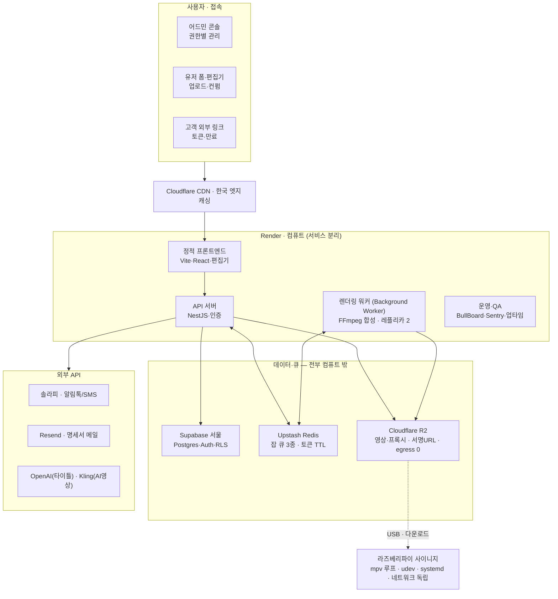
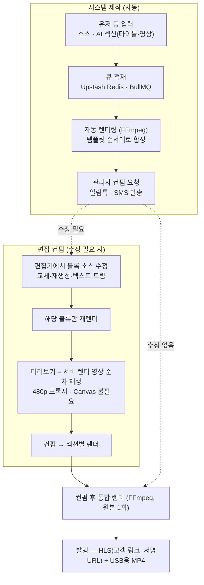

# 기술 명세서 v3 — 메모리아웍스 통합 추모 영상 및 사이니지 관리 시스템

> 공급자: 노드앤드 · 갱신일: 2026-06-17
> 견적서(2026-06-12) 부속 기술 문서. **이 문서가 기술 스펙의 단일 기준(single source of truth)**.
> v2 대비 변경: ① 컴퓨트 플랫폼 **Railway → Render** ② 미리보기 모델을 **서버 렌더 영상 재생(Canvas 불필요)**으로 통일 ③ 화면비 **16:9 고정** 명시 ④ 산출물 정리정책 반영.

---

## 1. 개요

견적서(2026-06-12) 2차 추가 개발 범위의 기술 구성을 정의한다. 시스템은 **프론트엔드 · 백엔드/렌더링 · 데이터/스토리지 · 현장 디바이스**의 네 개 레이어로 구성되며, 별도 상주 인력 없이 운영 가능한 관리형(Managed) 인프라를 원칙으로 한다.

영상은 파트너사별 템플릿이 블록 순서·구성을 고정하고, 유저 예약이 이를 펼친 **EDL 인스턴스**로 제작된다. **편집기 미리보기는 서버가 렌더한 블록 영상(480p 프록시)을 순차 재생**하며, 미리보기와 최종 렌더는 동일 EDL을 참조해 구조적으로 일치한다.

**핵심 원칙: ① 안정성 1순위(비용 차순위) ② 관리형 인프라 ③ 디바이스 네트워크 독립.**

---

## 2. 시스템 구조도

> **핵심**: API ↔ 렌더링 워커는 직접 호출 없이 **Redis 큐로만** 연결 → 렌더 부하가 어드민·고객 응답에 영향 없음. **데이터·큐·스토리지를 전부 컴퓨트(Render) 밖에 두어, Render가 통째로 죽어도 잃는 데이터 0.** 발행 영상은 R2+CDN, 사이니지는 로컬 재생이라 컴퓨트 장애 중에도 재생은 지속된다.

---

## 3. 영상 제작 플로우

시스템 제작은 유저 폼 입력에서 자동 렌더링·컨펌·다운로드까지 단방향으로 진행된다. 컨펌 전 수정은 편집기에서 블록 내부 소스만 교체·재생성하며(순서 불변), **미리보기는 서버가 렌더한 블록 영상을 그대로 재생**한다. 블록 순서는 템플릿으로 고정되며 편집기에서 순서를 바꾸지 않는다.

- **미리보기 ≠ 최종 렌더, 그러나 구조적 일치**: 둘 다 동일 EDL(순서·트림·오버레이·음소거·BGM)을 읽는다. 편집기는 **합성하지 않고**, 서버가 렌더한 블록별 영상(오버레이·영정틀·편지 텍스트가 이미 포함됨)을 순차 재생한다. → **Canvas/브라우저 실시간 합성 불필요.** 렌더 엔진 차이로 인한 미세 픽셀 차이는 비목표.
- **소스 변경 시**: 해당 블록만 재렌더 후 갱신(미렌더 구간은 "렌더링 중" 표시).
- **AI 결과 처리**: OpenAI 타이틀·Kling 영상은 별도 산출물로 생성·저장 → 컨펌·편집 단계에서 교체·재생성(AI 100% 비보장 대응).

---

## 4. 편집·렌더링 모델 (EDL)

템플릿은 블록의 순서·개수 규칙을 정의(순서 고정)하고, 유저 폼이 입력되면 이를 펼쳐 실제 소스를 채운 **EDL 인스턴스**(예약 1건)를 만든다. 미리보기 재생기와 FFmpeg 최종 렌더는 이 EDL 하나를 단일 소스로 읽는다. 어드민은 블록 내부 소스(사진 교체·재생성·텍스트·트림)만 수정하며 순서는 변경하지 않는다.

> 블록 흐름 다이어그램은 `../참고자료/EDL모델.png` 참조(현행 유지).

| 블록 타입 | 생성 방식 | 미리보기 | 수정 동작 |
|-----------|-----------|----------|-----------|
| 타이틀 | OpenAI 이미지→이미지 (사진 1장, 영정틀 오버레이, 15~20초) | 서버 렌더 영상 재생 | 사진 교체 → AI 재생성 |
| AI 영상 변환 | Kling 이미지→영상 (독사진 2장) | 서버 렌더 영상 재생 | 사진 교체 → AI 재생성 |
| 슬라이드 영상 | FFmpeg 합성 (유저 사진 + 업로드 클립) | 서버 렌더 영상 재생 | 소스 교체 → FFmpeg 재합성 |
| 클립 | 콘텐츠 허브 선업로드 (생성 없음) | 프록시 직접 재생 | 드롭다운으로 교체 |
| 편지 | FFmpeg + 텍스트 (배경음만, BGM 제외) | 서버 렌더 영상 재생 | 텍스트·소스 수정 |

---

## 5. 영상·오디오·출력 사양

- **출력 포맷**: HLS 스트리밍(고객 링크) + USB용 MP4 별도 추출.
- **화면비**: **16:9 고정.** 렌더 해상도·레이아웃을 설정값화하여 추후 9:16 확장 가능(단 영정틀·템플릿 등 디자인 자산 재작업 수반). 화면비 불일치 소스는 **잘림 없이 전체 표시 + 블러 배경**으로 여백을 채운다. HDR→SDR·VFR→CFR **자동 정규화**(프록시 단계 통합).
- **프록시**: 업로드 즉시 480p 저비트레이트 프록시 자동 생성. 편집기는 프록시 재생, 최종만 원본.
- **오디오**: 전체 1트랙 BGM + 구간 페이드. 편지=배경음만, 유저 원본=Mute. 관리자는 **BGM 곡 교체만** 가능.
- **컨펌**: 전건 수동 컨펌.
- **산출물 보관 정책**: 최종본 + 원본 소스만 보관. 중간 산출물(블록·섹션 렌더, 구버전 프록시 등)은 **N일(7~14일) 후 R2 라이프사이클로 자동 삭제** → 스토리지 무한 증가 방지.
- **길이·개수**: 하드캡 없음 + 안정성 가드(동적 타임아웃, 동시 업로드 제한, 디스크 여유, 레이지 로딩). 소프트 안내만(막지 않음). ※ 견적서 "소스 20개 내외·100MB"는 **소프트 가이드**로 해석 — 계약서에서 명문화 필요.
- **업로드**: tus(Uppy) 재개 업로드(사진·영상 혼재). 미완료 소스는 폼 제출 차단 + TTL 자동 청소.

---

## 6. 기술 스택

| 구분 | 기술 | 역할 |
|------|------|------|
| 프론트엔드 | Vite + React (TS) + Tailwind | 정적 SPA. 관리자/편집기 = **PC 전용 고정폭(비반응형)**, 유저 링크 = 모바일 트랙 |
| 영상 편집기 (PC 전용) | HTML5 `video` 순차 재생기 + 트림 슬라이더 | 서버 렌더 블록 영상(프록시) 재생 · 소스 교체. **Canvas 풀합성 없음** |
| 편집 모델 | 템플릿 + EDL (JSON) | 블록 순서·구성 규칙(고정) + 실행 인스턴스, 미리보기·렌더 단일 소스 |
| 업로드·프록시 | Uppy/tus + FFmpeg(워커) | 재개 업로드, 480p 프록시 자동 생성 |
| API 서버 | Node.js + NestJS | 예약·정산·권한, 큐 적재 |
| 렌더링 워커 | BullMQ(큐 3종) + FFmpeg (분리 서비스) | AI 외부호출·FFmpeg 합성·프록시 생성 분리, 최종 렌더. Render Background Worker, 레플리카 2 |
| AI 추상화 | Provider 어댑터 | OpenAI(타이틀)·Kling(AI영상) 고정, 어댑터로 교체 가능(런타임 선택 UI 없음). 프롬프트=리스트 선택형 |
| DB·인증 | Supabase (서울 리전) | Postgres·RLS, Supabase Auth → NestJS RBAC 검증 |
| 큐·세션 | Upstash Redis | 잡 큐 3종, 외부 링크 토큰 만료(TTL). **컴퓨트 밖에 둬 장애 시 큐 보존** |
| 스토리지 | Cloudflare R2 | 영상·프록시 저장·전송(egress 0), 서명 URL |
| 문자 | 솔라피 | 알림톡 우선 + SMS 폴백 |
| 이메일 | Resend | 거래명세서 PDF 발송 |
| CDN | Cloudflare | 프론트 한국 엣지, R2 영상 전송 |
| 운영·QA | BullBoard · Sentry · 업타임 모니터 | 잡 상태·실패 추적, 에러·장애 알림 |
| 디바이스 | 라즈베리파이 4 + Pi OS Lite | 사이니지 단독 재생(mpv 루프), 네트워크 독립 |
| 디바이스 자동화 | udev · systemd | USB 자동인식, ID 배치, 자동 재부팅 |
| 배포·운영 | **Render** + Git 자동배포 | 서비스 분리(웹·워커), 스테이징·PR 프리뷰, 워커 버스트 대비 레플리카, 전 서비스 Docker(이식성) |

> **컴퓨트 플랫폼 = Render** (Railway에서 전환). 근거: Railway 최근 6개월 주요 장애 5건(8시간 전면 장애 포함)으로 안정성 실적 감점 → 안정성 1순위 기준에서 Render 채택. 개발 착수 전이라 전환 비용 0, 고정요금이라 상시 워커 구성에 비용 예측 유리. 비상구 = 동급 PaaS 또는 거주성·SLA 필수화 시 AWS 서울(2차 과제).

---

## 7. 핵심 설계 원칙

1. **렌더링 워커 분리** — API와 워커는 Redis 큐로만 연결, 렌더 부하가 어드민·고객 응답에 영향 없음. 큐 적체 시 워커 인스턴스만 증설.
2. **EDL 단일 소스 미리보기** — 미리보기 재생기와 FFmpeg 최종 렌더가 동일 EDL을 읽어 구조적으로 일치(블록 순서·트림·오버레이·음소거·BGM). 렌더 엔진 차이로 인한 미세 픽셀 차이는 비목표.
3. **서버 렌더 미리보기 (Canvas 불필요)** — 오버레이·영정틀·편지 텍스트가 서버 렌더에 이미 포함되므로, 편집기는 합성하지 않고 480p 프록시를 **단일 `video`로 순차 재생**한다(편집기는 PC 전용, 10분 분량도 부드럽게 재생).
4. **AI 산출물 타입 분리** — 타이틀(OpenAI 이미지), AI 영상 변환(Kling 영상), 슬라이드(FFmpeg 합성)를 타입·provider·version으로 구분 관리. 슬라이드는 AI가 아닌 FFmpeg 합성이라 재생성이 빠르고 저렴.
5. **잡 큐 3종 분리** — AI 외부호출(느림·실패율), FFmpeg 내부합성(CPU), 프록시 생성을 별도 큐로 두고 동시성·재시도·타임아웃을 독립 설정.
6. **AI 실패 디그레이데이션** — AI 구간 생성 실패·지연 시 해당 구간을 제외하거나 정적 처리로 완성본을 우선 생성하고, 컨펌 단계에서 재생성(장례 시간 제약 대응).
7. **디바이스 네트워크 독립** — 라즈베리파이는 USB·다운로드로만 영상을 수령하며, 인터넷이 단절돼도 단독 반복 재생.
8. **무관리 운영** — 전 구성요소를 관리형 서비스로 구성하고 Git 푸시 자동배포. 발인 직전 버스트에 대비해 워커 최소 레플리카와 큐 깊이 모니터링.
9. **데이터·스토리지** — 관계형 데이터는 Supabase(서울), 대용량 영상·프록시는 Cloudflare R2(egress 무료)에 분리 저장. 외부 링크는 토큰 검증 후 만료형 서명 URL로 제공되어 퇴실 시 즉시 무효화.

---

## 8. 인증·권한 모델

- Supabase Auth가 신원 확인·JWT 발급을 담당하고, NestJS가 JWT를 검증하여 권한(RBAC)과 파트너사 테넌트 스코핑을 적용한다.
- RLS(Row-Level Security)는 직접 접근에 대한 2차 방어선으로 둔다.
- 렌더링 워커는 서비스 롤로 동작해 RLS를 우회하므로, 워커의 테넌트 격리는 애플리케이션 코드로 보장한다.
- 권한 계층: 사업부(총관리자) → 파트너사(장례식장, 자사 범위 제한).

---

## 9. 안정성 · QA · 운영

- **잡 신뢰성**: BullMQ 재시도·타임아웃·데드레터(DLQ)를 적용하고, AI 호출 실패·지연은 디그레이데이션 + 컨펌 단계 재생성. 멱등성(중복 클릭·중복 발송 방지).
- **버스트 대응**: 발인 직전 동시 요청에 대비해 워커 최소 레플리카(2)를 확보하고 큐 깊이를 모니터링. **자원 크기 = 서버단(Render 설정) / 안전 로직(동시성·디스크 가드·타임아웃) = 개발단(코드·환경변수)**. 정확한 수치는 프로토타입 실측.
- **가시성**: 실패 잡 대시보드(BullBoard)로 관리자가 직접 상태 확인·재처리.
- **모니터링**: 에러 트래킹(Sentry)과 외부 의존성(Kling·OpenAI·솔라피) 업타임·알림.
- **검증 환경**: 스테이징·브랜치 프리뷰 환경을 자동 생성하여 1차 프로토타입(6/28) 공동 QA 지원. 운영 승격 전 스테이징 검증.
- **라즈베리파이 무중단**: **소프트웨어 무중단 = 개발 범위**(읽기전용 FS·워치독·예약 재부팅·끊김 없는 전환·장애 시 직전 영상 유지). **하드웨어 무중단 = 메모리아웍스 영역**(냉각·예비기기·선플래시 SD·원격 모니터링). 계약에 "하드웨어 고장은 개발사 책임 외" 명시.

---

## 10. 외부 연동 및 비용 책임 구분

- **AI 생성(OpenAI 타이틀, Kling 영상)** 비용은 운영사(메모리아웍스) 부담이며 본 개발 범위에서 제외.
- **문자(솔라피)·이메일(Resend)** 발송 비용은 사용량 기반 운영사 부담. 문자 발신번호 사전등록과 알림톡 템플릿 심사는 **운영사 선행 준비 사항으로 일정 임계경로에 있음(즉시 착수 필요)**.
- **세금계산서 발행은 개발 범위에서 제외**되며, 시스템은 거래명세서 제작·이메일 발송까지 지원(견적서 조건과 동일).
- 정산: 단가 **스냅샷 고정**(기준=예약 생성 시점) + 발행 거래명세서 동결. 어드민 수정은 미발행 항목만.

### 예상 운영 비용 (참고용, 본 개발 견적과 별개)

| 구분 | 항목 | 예상 비용 |
|------|------|-----------|
| 본 시스템 인프라 (구축 범위) | Render · Supabase(서울) · Cloudflare R2 · Upstash Redis | 월 약 13~20만 원 (사용량 추정) |
| 개발 범위 외 (운영 변동비) | AI 생성 — OpenAI · Kling | 생성 건당 변동 |
| 개발 범위 외 (운영 변동비) | 문자(솔라피) · 이메일(Resend) | 발송 건당 |

---

## 11. 전제 및 비고

- **데이터 거주성**: Cloudflare R2에는 영상·프록시(민감 데이터)가, Supabase 서울에는 메타데이터가 저장된다. 영상까지 국외 보관이 가능함을 전제로 R2를 채택했으며, 국내 보관이 필수일 경우 스토리지 레이어만 Supabase Storage 서울로 대체 가능(타 구성 영향 없음).
- **일정 단계화**: 풀 영상 편집기는 난이도가 높아, 1차 프로토타입(6/28)은 자동 파이프라인·기본 미리보기를 우선하고 풀 편집 기능은 최종 검수(7/12)로 단계화 권장. 표준 공수(10~14주)를 크게 압축한 일정 → **안정성 검증 시간 제한이 가장 큰 리스크**(재협의 권장).
- **미리보기 일치**: 미리보기와 최종 렌더는 EDL 기준으로 구조적으로 일치하며, 렌더 엔진 차이에 의한 미세 픽셀 동일성은 보장 대상이 아니다.
- **디바이스 핸드오프**: 최종본의 라즈베리파이 전달은 다운로드 후 USB 반입 운영을 전제로 한다. 서명 URL 무효화는 이후 접근 차단이며, 이미 다운로드된 사본의 회수를 의미하지 않는다. (USB 핸드오프 주체·SD 굽기·첫 셋업 담당은 메모리아웍스와 확인 필요.)
- **데이터 보관 정책**(3개월~1년)은 R2 라이프사이클 규칙으로 적용하며 운영 중 확정. 세부 산출물 범위·결제 조건은 계약 체결 시 별도 협의.
- **개인정보(PIPA)**: 유족 삭제 요청 워크플로·보관기간 근거는 메모리아웍스와 확인 필요.

---

## 12. 메모리아웍스 확인 필요 (미해결)

| 항목 | 상태 |
|------|------|
| **유저 주체** | ⚠️ 유족 직접 / 직원 대행 / 둘 다 — 인증·폼 공개 여부·업로드 흐름을 좌우. **가장 먼저 확인** |
| **사이니지 범위** | ⚠️ 완성 영상 루프 재생만 vs 정보 안내 화면도 — 후자는 funein류 협의 건(추가 견적) |
| 운영사 선행작업(임계경로) | ⚠️ 발신번호 사전등록(1~2일), 알림톡 템플릿 다종 등록·심사 — **즉시 착수 필요** |
| 일정 vs 안정성 | ⚠️ 6/28·7/12 고정은 안정성 1순위와 충돌 — 재협의 권장 |
| USB 핸드오프 | ⚠️ 최종본 라즈베리파이 전달 주체, SD 굽기·첫 셋업 담당 |
| 개인정보(PIPA) | ⚠️ 유족 삭제 요청 워크플로·보관기간 근거 |
| 소스 개수 정책 | ⚠️ 견적 "20개 내외" vs 결정 "하드캡 없음+소프트 안내" — 계약서 명문화 |
